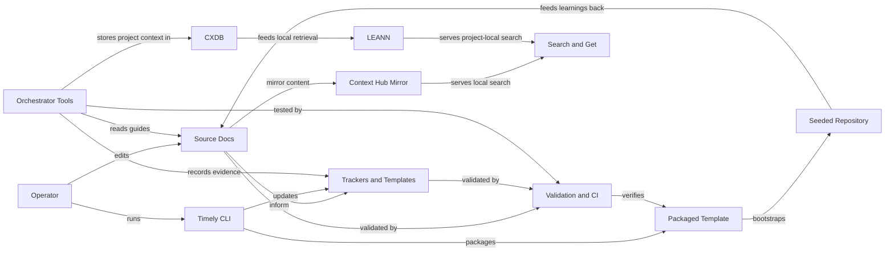

# DFD

```mermaid
flowchart LR
    Operator[Operator]
    Docs[Source Docs]
    Trackers[Trackers and Templates]
    CLI[Timely CLI]
    Orchestrator[Orchestrator Tools]
    Chub[Context Hub Mirror]
    CXDB[CXDB]
    LEANN[LEANN]
    CI[Validation and CI]
    Package[Packaged Template]
    Downstream[Seeded Repository]
    Retrieval[Search and Get]

    Operator -->|edits| Docs
    Operator -->|runs| CLI
    Docs -->|inform| Trackers
    Docs -->|mirror content| Chub
    CLI -->|updates| Trackers
    CLI -->|packages| Package
    Orchestrator -->|reads guides| Docs
    Orchestrator -->|records evidence| Trackers
    Orchestrator -->|stores project context in| CXDB
    CXDB -->|feeds local retrieval| LEANN
    Chub -->|serves local search| Retrieval
    LEANN -->|serves project-local search| Retrieval
    Docs -->|validated by| CI
    Trackers -->|validated by| CI
    Orchestrator -->|tested by| CI
    CI -->|verifies| Package
    Package -->|bootstraps| Downstream
    Downstream -->|feeds learnings back| Docs
```
