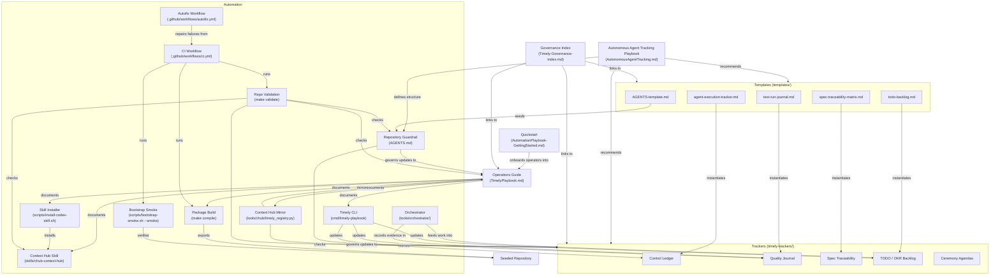

```mermaid
flowchart TD
    Playbook["Autonomous Agent Tracking Playbook\n(AutonomousAgentTracking.md)"]
    Runbook["Quickstart\n(AutomationPlaybook-GettingStarted.md)"]
    Guide["Operations Guide\n(TimelyPlaybook.md)"]
    Index["Governance Index\n(Timely-Governance-Index.md)"]

    subgraph Governance["Trackers (timely-trackers/)"]
        Ledger["Control Ledger"]
        Journal["Quality Journal"]
        Trace["Spec Traceability"]
        Backlog["TODO / OKR Backlog"]
        Agendas["Ceremony Agendas"]
    end

    subgraph Templates["Templates (templates/)"]
        AgentsTpl["AGENTS-template.md"]
        LedgerTpl["agent-execution-tracker.md"]
        JournalTpl["test-run-journal.md"]
        TraceTpl["spec-traceability-matrix.md"]
        BacklogTpl["todo-backlog.md"]
    end

    subgraph Automation["Automation"]
        RepoAgents["Repository Guardrail\n(AGENTS.md)"]
        TimelyCLI["Timely CLI\n(cmd/timely-playbook)"]
        Orchestrator["Orchestrator\n(tools/orchestrator/)"]
        Chub["Context Hub Mirror\n(tools/chub/timely_registry.py)"]
        ChubSkill["Context Hub Skill\n(skills/chub-context-hub)"]
        SkillInstall["Skill Installer\n(scripts/install-codex-skill.sh)"]
        Validate["Repo Validation\n(make validate)"]
        Package["Package Build\n(make compile)"]
        Smoke["Bootstrap Smoke\n(scripts/bootstrap-smoke.sh --smoke)"]
        CI["CI Workflow\n(.github/workflows/ci.yml)"]
        Autofix["Autofix Workflow\n(.github/workflows/autofix.yml)"]
    end

    Downstream["Seeded Repository"]

    Playbook -->|defines structure| RepoAgents
    Playbook -->|recommends| Governance
    Playbook -->|recommends| Templates
    Runbook -->|onboards operators into| Guide
    Index -->|links to| Guide
    Index -->|links to| Governance
    Index -->|links to| Templates

    AgentsTpl -->|seeds| RepoAgents
    LedgerTpl -->|instantiates| Ledger
    JournalTpl -->|instantiates| Journal
    TraceTpl -->|instantiates| Trace
    BacklogTpl -->|instantiates| Backlog

    RepoAgents -->|governs updates to| Governance
    RepoAgents -->|governs updates to| Guide
    Guide -->|documents| TimelyCLI
    Guide -->|documents| Chub
    Guide -->|documents| ChubSkill
    Guide -->|documents| SkillInstall
    Guide -->|documents| Package
    Orchestrator -->|records evidence in| Journal
    Orchestrator -->|feeds work into| Backlog
    TimelyCLI -->|updates| Ledger
    TimelyCLI -->|updates| Journal
    TimelyCLI -->|updates| Backlog
    Chub -->|mirrors| Guide
    Chub -->|mirrors| Governance
    SkillInstall -->|installs| ChubSkill
    Validate -->|checks| Guide
    Validate -->|checks| Governance
    Validate -->|checks| RepoAgents
    Validate -->|checks| ChubSkill
    Package -->|exports| Downstream
    Smoke -->|verifies| Downstream
    CI -->|runs| Validate
    CI -->|runs| Package
    CI -->|runs| Smoke
    Autofix -->|repairs failures from| CI

    click Playbook "AutonomousAgentTracking.md" "Open playbook"
    click Runbook "AutomationPlaybook-GettingStarted.md" "Open quickstart"
    click Guide "TimelyPlaybook.md" "Open operations guide"
    click Index "Timely-Governance-Index.md" "Open governance index"
    click Ledger "timely-trackers/agent-control-ledger.md" "Open control ledger"
    click Journal "timely-trackers/test-run-journal.md" "Open quality journal"
    click Trace "timely-trackers/spec-traceability.md" "Open traceability matrix"
    click Backlog "timely-trackers/todo-backlog.md" "Open backlog"
    click Agendas "timely-trackers/ceremony-agendas.md" "Open ceremony agendas"
    click AgentsTpl "templates/AGENTS-template.md" "Open AGENTS template"
    click LedgerTpl "templates/agent-execution-tracker.md" "Open ledger template"
    click JournalTpl "templates/test-run-journal.md" "Open journal template"
    click TraceTpl "templates/spec-traceability-matrix.md" "Open traceability template"
    click BacklogTpl "templates/todo-backlog.md" "Open backlog template"
    click RepoAgents "AGENTS.md" "Open repository guardrail"
    click TimelyCLI "cmd/timely-playbook/main.go" "Open Timely CLI"
    click Orchestrator "tools/orchestrator/orchestrator.py" "Open orchestrator"
    click Chub "tools/chub/timely_registry.py" "Open Context Hub mirror generator"
    click ChubSkill "skills/chub-context-hub/SKILL.md" "Open Context Hub skill bundle"
    click SkillInstall "scripts/install-codex-skill.sh" "Open skill installer"
    click CI ".github/workflows/ci.yml" "Open CI workflow"
    click Autofix ".github/workflows/autofix.yml" "Open autofix workflow"
```
